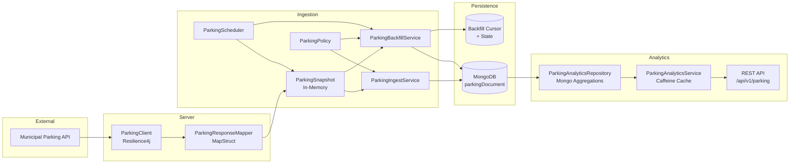
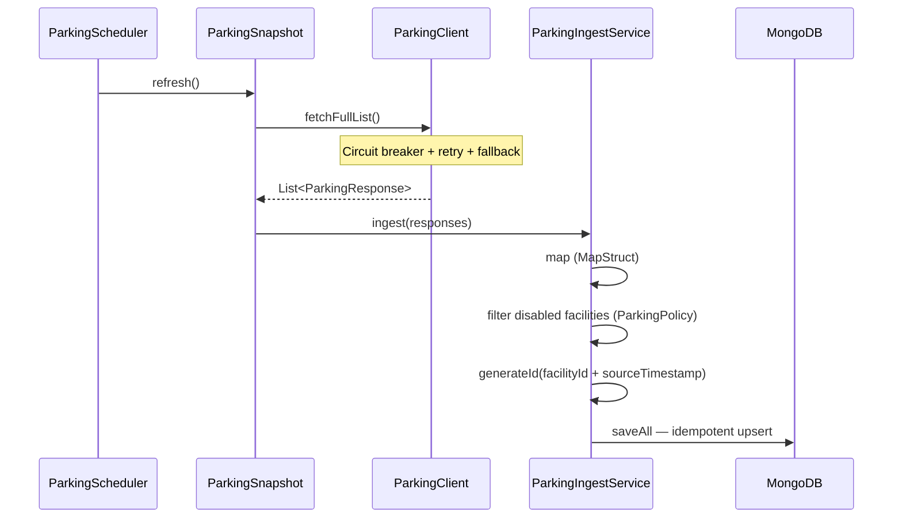
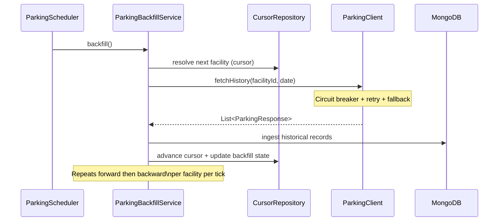
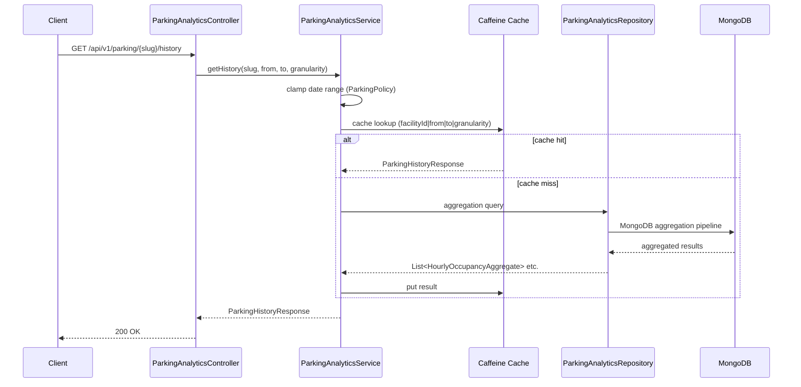

# Metro Parking Web Service


[](#)

A production-grade Spring Boot service that ingests, persists, and serves real-time and historical parking occupancy data from an external municipal API. Designed for resilience, idempotency, and long-running historical reconstruction with a clean analytics API on top.

---

## Architecture

The system is organised into four distinct concerns: external API integration, ingestion and transformation, backfill orchestration, and an analytics read layer.



---

## Data Flows

### Live Ingestion

Every 15 seconds the scheduler triggers a full snapshot refresh. The external API response is mapped, filtered against the disabled-facilities policy, deduplicated via a deterministic composite ID, and upserted into MongoDB.



### Backfill Orchestration

After each live snapshot, the scheduler drives a cursor-based backfill. The service works forward from the most recent gap first, then walks backward through the configured window. Each facility advances independently; state is persisted so the process survives restarts.



### Analytics Read Path



---

## Key Design Decisions

### Idempotent Writes

Documents are keyed by a deterministic composite ID — `facilityId_sourceTimestamp`. MongoDB's upsert behaviour means repeated ingestion of the same data point from both the live snapshot and the backfill path is safe with no deduplication logic required at the service layer.

### Dual-Direction Backfill

`ParkingBackfillService` implements a forward-first, backward-second strategy per facility. Forward fill closes recent gaps that may have been missed during downtime. Backward fill reconstructs historical data up to the configured window (`backfill-window: 31` days). A persistent cursor document tracks position across restarts.

### Resilience Chain

All calls to the external API pass through a Resilience4j decorator chain:

```
Supplier → CircuitBreaker → Retry (exponential backoff) → Fallback (empty list)
```

The circuit breaker opens after 50% failure rate over a 10-call sliding window, waits 30 seconds, then allows 3 probe calls in half-open state. Retries use exponential backoff (2s base, 2× multiplier, max 3 attempts).

### Analytics Caching

`ParkingAnalyticsService` caches `ParkingHistoryResponse` objects in a Caffeine cache keyed by `facilityId|from|to|granularity`. Entries expire after 1 hour with a maximum of 10,000 entries, keeping repeated dashboard loads cheap without stale data accumulating.

---

## REST API

Base path: `/api/v1/parking`

| Method | Endpoint | Description |
|--------|----------|-------------|
| `GET` | `/` | Current occupancy snapshot for all facilities |
| `GET` | `/{slug}/overview` | Current occupancy for a single facility |
| `GET` | `/{slug}/history` | Historical occupancy data with configurable granularity |

### History Query Parameters

| Parameter | Type | Required | Description |
|-----------|------|----------|-------------|
| `from` | `YYYY-MM-DD` | Yes | Start date (clamped to backfill window floor) |
| `to` | `YYYY-MM-DD` | Yes | End date (clamped to yesterday) |
| `granularity` | enum | No | `TEN_MINUTE`, `HOURLY` (default), `DAILY` |

`TEN_MINUTE` granularity is automatically constrained to a maximum 7-day window.

### Error Responses

All errors return a structured JSON body:

```json
{
  "error": "Invalid request parameters",
  "timestamp": "2026-01-15T10:30:00Z"
}
```

| Status | Condition |
|--------|-----------|
| `400` | Missing or malformed parameters |
| `404` | Unknown endpoint |
| `429` | Rate limit exceeded |
| `500` | Unexpected server error |

---

## Security

### Rate Limiting

All `/api/**` endpoints are protected by a per-IP token bucket via Bucket4j backed by a Caffeine store.

| Property | Value |
|----------|-------|
| Capacity | 60 requests |
| Refill | 60 tokens / 60 seconds (greedy) |
| Client identification | `X-Forwarded-For` → `remoteAddr` |
| Bucket eviction | 30 minutes of inactivity |

Requests exceeding the limit receive `HTTP 429` with `{"error": "Too many requests"}`.

### Spring Security

- Stateless sessions (no server-side session)
- CORS restricted to configured allowed origins; `GET` and `OPTIONS` only
- HSTS enforced (`max-age=31536000`, `includeSubDomains`)
- Frame options: `DENY`
- Referrer policy: `STRICT_ORIGIN_WHEN_CROSS_ORIGIN`
- All routes not under `/api/v1/parking/**` or `/actuator/health` are denied

---

## Configuration

| Property | Default | Description |
|----------|---------|-------------|
| `MONGODB_URI` | `mongodb://localhost:27017/metro-parking-database` | MongoDB connection string |
| `PARKING_BASE_URL` | — | External API base URL |
| `PARKING_API` | — | API path |
| `PARKING_APIKEY` | — | API key |
| `ALLOWED_ORIGINS` | `http://localhost:5173` | CORS allowed origins |
| `API_DOCS` | `false` | Enable OpenAPI docs |
| `SWAGGER_UI` | `false` | Enable Swagger UI |

### Policy Configuration (`application.yml`)

```yaml
external-server:
  parking:
    policy:
      disabled-facilities: [1, 2, 3, 4, 5]  # Excluded from ingestion
      backfill-window: 31                     # Days of history to maintain
    security:
      rate-limit:
        capacity: 60
        refill-tokens: 60
        refill-period-seconds: 60
```

---

## Testing

### Unit Tests (Mockito)

- **`ParkingIngestServiceTest`** — mapping pipeline, disabled-facility filtering, null/empty input handling, composite ID generation
- **`ParkingBackfillServiceTest`** — forward/backward fill transitions, cursor progression, facility wrap-around, policy-based skipping
- **`ParkingSnapshotTest`** — state updates from API responses, null-safe handling, facility ID extraction
- **MapStruct mappers** — `ParkingResponseMapper` and `ParkingDocumentMapper` verified via `Mappers.getMapper(...)`

### Integration Tests (WireMock)

- **`ParkingClientITTest`** — `/full-list` and `/history` contract validation, retry behaviour (server error → eventual success), circuit breaker open/fallback verification, query parameter correctness

---

## Running Locally

```bash
# Start the application
./mvnw spring-boot:run

# Run tests
./mvnw test
```

MongoDB must be reachable at the configured URI. The scheduler is suppressed in the `test` profile.